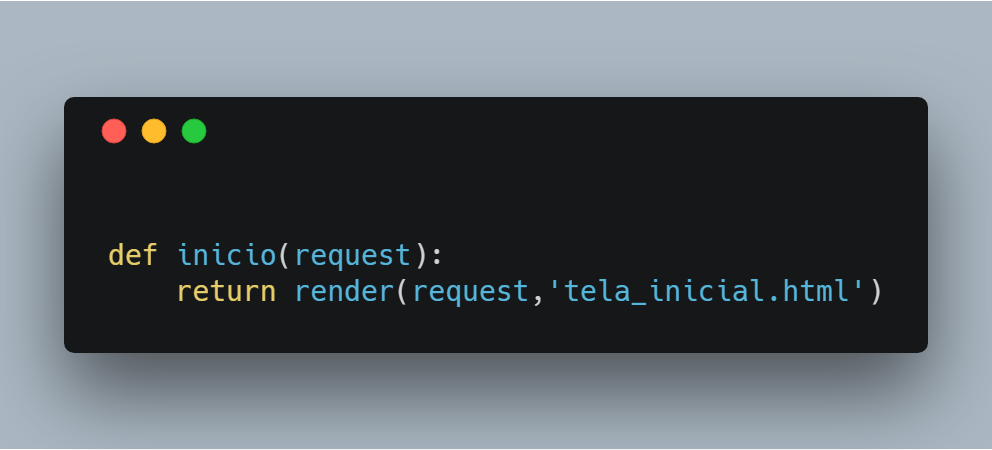
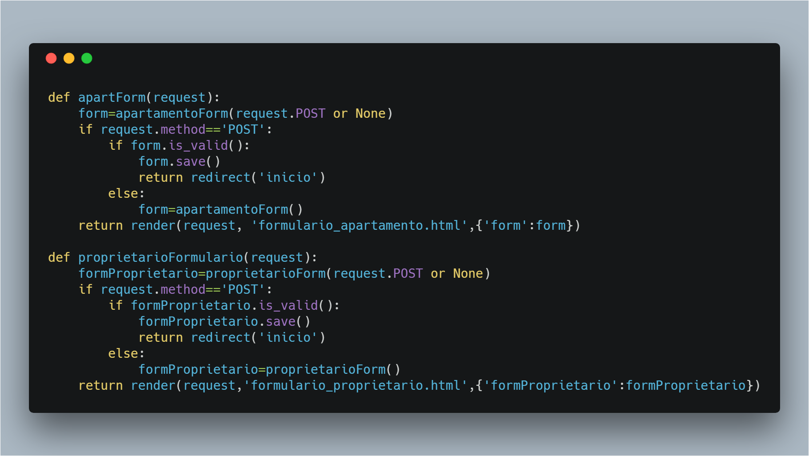
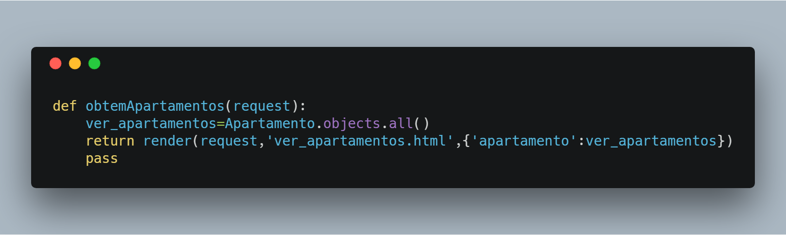

# ProjetoCondominio

# Aplicativo de Gestão de Condomínio

Projeto de um aplicativo de gestão de condomínio em python usando framework django

# Status deste código

Em desenvolvimento

# Casos de uso

Tela inicial

Formularios de cadastro de apartamentos e proprietários respectivamente

Obter lista de apartamentos

